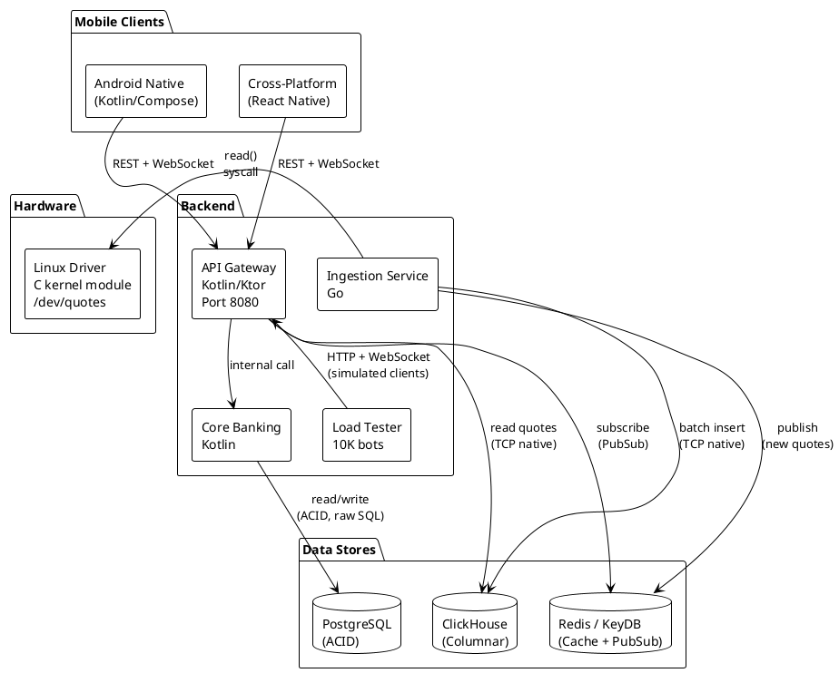
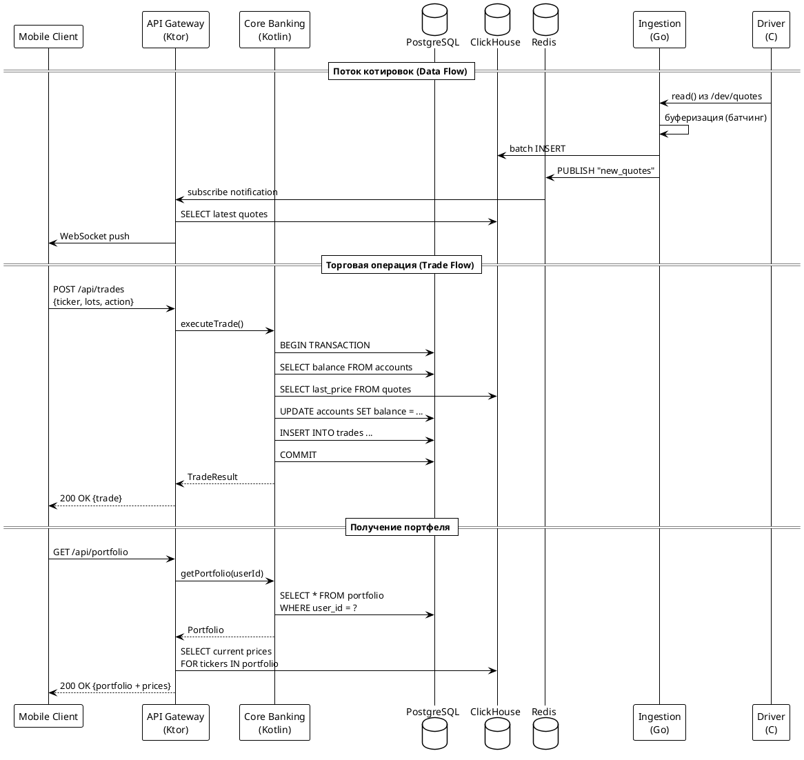
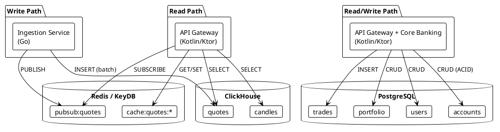
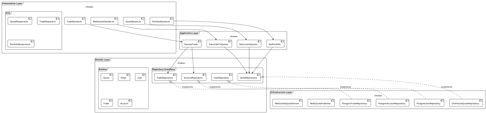
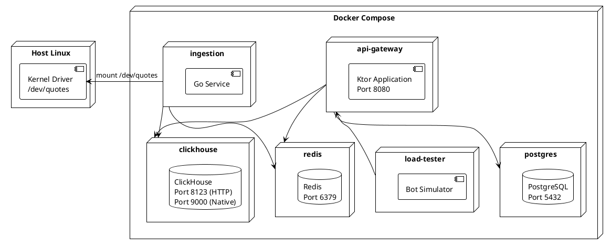

# Архитектура системы HighLoad Invest Ecosystem — Backend

## 1. Обоснование выбора архитектуры

| Фактор | Значение | Влияние на выбор |
|--------|----------|------------------|
| Команда | до 10 человек | Микросервисы (задано ТЗ) |
| Сложность домена | Высокая (финансы + realtime) | Элементы DDD |
| Языки | Kotlin, Go, C | Полиглот — микросервисы обязательны |
| Базы данных | ClickHouse, PostgreSQL, Redis | Database-per-service |
| Масштабирование | 10K сессий | Горизонтальное для API Gateway |
| Консистентность | ACID (финансы) + Eventual (котировки) | Разделение ответственности по БД |

Техническое задание жёстко задаёт микросервисную архитектуру с 5 сервисами на 3 языках. Это обосновано:
- Разные языки для разных задач (Kotlin для API, Go для high-throughput ingestion, C для kernel).
- Разные требования к масштабированию (API Gateway — горизонтально, Driver — один экземпляр).
- Разные модели консистентности (ACID vs Eventual).

## 2. Общая схема системы



## 3. Коммуникация между сервисами



## 4. Таблица коммуникаций

| Связь | Тип | Протокол | Обоснование |
|-------|-----|----------|-------------|
| Client → API Gateway | Синхронный | REST + WebSocket | Стандартный API для мобильных |
| API Gateway → Core Banking | Синхронный | Internal (in-process) | Сделки требуют синхронного ответа |
| API Gateway → ClickHouse | Синхронный | TCP (native client) | Запрос текущих котировок |
| API Gateway ← Redis | Асинхронный | PubSub (subscribe) | Push котировок через WebSocket |
| Ingestion → ClickHouse | Асинхронный | TCP (batch insert) | Батчевая вставка котировок |
| Ingestion → /dev/quotes | Синхронный | read() syscall | Чтение из character device |
| Ingestion → Redis | Асинхронный | PUBLISH | Уведомление о новых данных |
| Load Tester → API Gateway | Синхронный | HTTP + WebSocket | Имитация 10K клиентов |

## 5. Data Patterns — Database-per-Service



**Принцип разделения данных:**
- **ClickHouse** — запись: только Ingestion-сервис; чтение: API Gateway.
- **PostgreSQL** — чтение/запись: Core Banking через API Gateway.
- **Redis** — общий кэш горячих котировок + PubSub для WebSocket push.

## 6. Clean Architecture внутри Kotlin-сервисов



**Правило зависимостей:** зависимости направлены строго внутрь. Domain Layer не знает ни о ClickHouse, ни о PostgreSQL, ни о Ktor.

### Структура каталогов

```
api-gateway/
├── src/main/kotlin/
│   ├── domain/                    # Чистая бизнес-логика (без зависимостей)
│   │   ├── entities/
│   │   │   ├── Quote.kt           # Котировка
│   │   │   ├── Ticker.kt          # Тикер акции
│   │   │   ├── User.kt            # Пользователь
│   │   │   ├── Account.kt         # Счёт
│   │   │   └── Trade.kt           # Сделка
│   │   └── repositories/          # Только интерфейсы
│   │       ├── QuoteRepository.kt
│   │       ├── UserRepository.kt
│   │       ├── TradeRepository.kt
│   │       └── AccountRepository.kt
│   │
│   ├── application/               # Use cases
│   │   ├── GetCurrentQuotes.kt
│   │   ├── SubscribeToQuotes.kt
│   │   ├── ExecuteTrade.kt
│   │   └── GetPortfolio.kt
│   │
│   ├── infrastructure/            # Реализации интерфейсов
│   │   ├── clickhouse/
│   │   │   └── ClickHouseQuoteRepository.kt
│   │   ├── postgres/
│   │   │   ├── PostgresUserRepository.kt
│   │   │   ├── PostgresTradeRepository.kt
│   │   │   └── PostgresAccountRepository.kt
│   │   ├── redis/
│   │   │   └── RedisQuotePublisher.kt
│   │   └── websocket/
│   │       └── WebSocketQuoteStream.kt
│   │
│   └── presentation/              # Ktor routes + DTO
│       ├── routes/
│       │   ├── QuoteRoutes.kt
│       │   ├── TradeRoutes.kt
│       │   └── PortfolioRoutes.kt
│       └── dto/
│           ├── QuoteResponse.kt
│           ├── TradeRequest.kt
│           └── PortfolioResponse.kt
│
├── src/test/kotlin/               # Тесты
├── build.gradle.kts
└── Dockerfile
```

## 7. Ключевые архитектурные решения (ADR)

### ADR-001: ClickHouse как источник правды для котировок
- **Контекст:** Требование ТЗ (FR-SYS-03) — все запросы на получение цены обслуживаются выборками из ClickHouse, а не из in-memory кэша.
- **Решение:** Ingestion-сервис пишет в ClickHouse, API Gateway читает из ClickHouse.
- **Последствия:** Задержка обновления (батчинг + disk I/O), компенсируется Redis-кэшем для горячих данных.

### ADR-002: Батчинг в Go Ingestion-сервисе
- **Контекст:** Драйвер генерирует поток котировок непрерывно. ClickHouse оптимизирован для batch insert, а не построчной вставки.
- **Решение:** Go-сервис накапливает котировки в буфер и вставляет пачками (например, каждые 100ms или 1000 записей).
- **Последствия:** Увеличенная пропускная способность, но добавляется задержка буферизации.

### ADR-003: Redis PubSub для push-уведомлений
- **Контекст:** Клиенты должны получать обновления котировок в реальном времени (< 1 сек от генерации).
- **Решение:** Ingestion публикует в Redis PubSub при каждом батче. API Gateway подписан и пушит через WebSocket.
- **Последствия:** Decoupling между Ingestion и API Gateway. Redis как единая точка для pub/sub.

### ADR-004: PostgreSQL с голым SQL (без ORM)
- **Контекст:** Требование ТЗ. Финансовые операции требуют строгого контроля транзакций (ACID).
- **Решение:** Прямые SQL-запросы через JDBC-драйвер (например, Exposed в SQL DSL режиме или чистый JDBC).
- **Последствия:** Полный контроль над запросами и транзакциями, но больше boilerplate.

### ADR-005: Koin для Dependency Injection
- **Контекст:** Clean Architecture требует инверсии зависимостей. Ktor не имеет встроенного DI.
- **Решение:** Koin — лёгковесный DI-фреймворк, идиоматичный для Kotlin, хорошо интегрируется с Ktor.
- **Последствия:** Простая конфигурация, тестируемость через подмену реализаций.

## 8. Схема развёртывания



## 9. Нефункциональные требования и архитектурные ответы

| Требование | Значение | Архитектурный ответ |
|-----------|----------|---------------------|
| NFR-001 Latency | < 1 сек от генерации до клиента | Redis PubSub + WebSocket push, батч < 100ms |
| NFR-002 Throughput | 10K активных сессий | Горизонтальное масштабирование API Gateway, корутины Ktor |
| NFR-003 Consistency | ACID для балансов | PostgreSQL транзакции, serializable isolation |
| FR-OBS-01 Metrics | RPS, Error Rate, Latency | OpenTelemetry SDK → Collector → Grafana |
| FR-OBS-02 Tracing | Сквозной трейсинг | OpenTelemetry trace context propagation |
