# Техническое задание

## Назначение системы

Разрабатываемая система предназначена для учебной имитации брокерской экосистемы.
Она получает поток котировок, сохраняет историю цен, отдаёт данные мобильным
клиентам и выполняет учебные торговые операции без реальных банковских
транзакций.

## Состав системы

В соответствии с практическим заданием система включает следующие компоненты:

1. Мобильное приложение Android на Kotlin и Jetpack Compose.
2. Кросс-платформенное мобильное приложение на React Native.
3. API-сервис для связи с мобильными приложениями на Kotlin/Ktor.
4. Сервис пользовательских данных и торговых операций на Kotlin.
5. Сервис имитации 10 000 мобильных клиентов для нагрузочного тестирования.
6. Сервис получения котировок на Go.
7. Драйвер Linux на C, имитирующий поток биржевых котировок.

## Технологические требования

| Область | Требование |
|---|---|
| Нативный клиент | Android, Kotlin, Jetpack Compose |
| Кросс-платформенный клиент | React Native |
| Backend API | Kotlin, Ktor, coroutines, JSON serialization |
| Сбор котировок | Go |
| Генерация котировок | Linux driver, C |
| Кэш и сообщения | Redis |
| Пользовательские данные | PostgreSQL, SQL |
| История котировок | ClickHouse |
| Телеметрия | OpenTelemetry |
| Развёртывание | Docker Compose |

## Функциональные требования

Функциональные требования сформулированы в формате SRS: каждое требование
имеет идентификатор, проверяемую формулировку и критерий приёмки.

| ID | Требование | Критерий приёмки |
|---|---|---|
| FR-01 | Система должна генерировать поток котировок на уровне ядра Linux через драйвер на C. | После загрузки модуля доступно устройство `/dev/quotes`, из которого можно читать котировки. |
| FR-02 | Ingestion-сервис должен читать котировки из `/dev/quotes` или fallback-генератора и нормализовать их к структуре `ticker`, `price`, `volume`, `timestamp`. | Валидные строки драйвера преобразуются в объекты котировок; невалидные строки не останавливают обработку. |
| FR-03 | Ingestion-сервис должен батчами сохранять котировки в ClickHouse. | Таблица `quotes` пополняется новыми записями; размер батча и интервал flush управляются параметрами окружения. |
| FR-04 | ClickHouse должен выступать источником истины для текущих и исторических котировок. | API получает последние цены и свечные данные выборками из ClickHouse. |
| FR-05 | API Gateway должен предоставлять REST endpoint для получения списка последних котировок. | `GET /api/quotes` возвращает JSON-массив актуальных котировок. |
| FR-06 | API Gateway должен предоставлять REST endpoint для получения свечных данных по тикеру. | `GET /api/quotes/{ticker}/candles?from=...&to=...` возвращает OHLCV-данные. |
| FR-07 | Система должна доставлять realtime-обновления котировок через WebSocket. | Подключённый клиент `WS /ws/quotes` получает сообщения, опубликованные ingestion-сервисом через Redis Pub/Sub. |
| FR-08 | Backend должен предоставлять единый внешний API для native Android и React Native клиентов. | Оба клиента используют одинаковые REST/WebSocket endpoints. |
| FR-09 | Система должна позволять создать учебного пользователя и инвестиционный счёт. | `POST /api/users` создаёт пользователя, счёт и возвращает идентификатор пользователя. |
| FR-10 | Система должна поддерживать пополнение учебного счёта условными средствами. | `POST /api/accounts/{userId}/deposit` увеличивает баланс пользователя в PostgreSQL. |
| FR-11 | Система должна исполнять BUY-заявку при достаточном балансе. | Покупка уменьшает баланс, увеличивает позицию портфеля и записывает сделку в одной транзакции. |
| FR-12 | Система должна исполнять SELL-заявку при достаточном количестве лотов. | Продажа увеличивает баланс, уменьшает позицию портфеля и записывает сделку в одной транзакции. |
| FR-13 | Система должна отклонять некорректные торговые операции. | Неположительные лоты, неположительная цена, недостаточный баланс или недостаточная позиция возвращают ошибку без изменения финансовых данных. |
| FR-14 | Система должна возвращать портфель пользователя. | `GET /api/portfolio/{userId}` возвращает баланс, валюту и список позиций по тикерам. |
| FR-15 | Native Android клиент должен реализовывать основной пользовательский сценарий. | Пользователь может зарегистрироваться, видеть котировки, получить realtime-обновление, пополнить счёт, купить/продать лоты и посмотреть портфель. |
| FR-16 | React Native клиент должен реализовывать тот же основной сценарий. | Cross-platform клиент функционально сопоставим с native Android клиентом. |
| FR-17 | Система должна собирать метрики и распределённые трассы. | Метрики доступны в Grafana/Prometheus, traces доступны в Jaeger. |
| FR-18 | Система должна включать нагрузочный тестер. | Load-tester создаёт пользователей, выполняет REST-запросы, торговые операции и WebSocket-подключения с параметризуемой нагрузкой. |
| FR-19 | Система должна воспроизводимо запускаться на стенде. | Docker Compose поднимает PostgreSQL, ClickHouse, Redis, backend, ingestion и observability-компоненты с healthcheck-ами. |

## Нефункциональные требования

Нефункциональные требования определяют не отдельные функции, а свойства системы:
производительность, согласованность, наблюдаемость, сопровождаемость и
воспроизводимость.

| ID | Категория | Требование | Проверка |
|---|---|---|---|
| NFR-01 | Performance | Задержка доставки realtime-котировки на клиентский терминал должна стремиться к значению менее 1 секунды на демонстрационном стенде. | Сравнение timestamp котировки, WebSocket-доставки, UI-обновления и trace/metrics в Grafana/Jaeger. |
| NFR-02 | Scalability | Архитектура должна быть рассчитана на сценарий до 10 000 активных пользовательских сессий. | Запуск load-tester с параметрами `BOT_COUNT`, `ACTIVE_REQUESTS`, `WS_PERCENT`; контроль error rate и latency. |
| NFR-03 | Consistency | Финансовые данные должны сохранять ACID-согласованность. | Core Banking выполняет сделки в транзакции PostgreSQL с блокировками `SELECT ... FOR UPDATE`. |
| NFR-04 | Consistency | Market-data контур может иметь eventual consistency и потерю промежуточных realtime-событий, но исторические котировки должны сохраняться в ClickHouse. | Сравнение данных WebSocket, REST API и таблицы `quotes` в ClickHouse. |
| NFR-05 | Observability | Поведение backend и ingestion должно быть наблюдаемым через метрики и распределённые трассы. | Наличие Grafana dashboard, Prometheus metrics и Jaeger traces. |
| NFR-06 | Operability | Система должна воспроизводимо разворачиваться из репозитория. | Запуск стенда через `docker compose up -d --build` без ручной установки БД и observability-инструментов. |
| NFR-07 | Reliability | При недоступности `/dev/quotes` демонстрационный стенд должен иметь fallback-режим генерации котировок. | Ingestion запускается без драйвера и всё равно публикует котировки в ClickHouse/Redis. |
| NFR-08 | Maintainability | Архитектура должна явно разделять уровни: kernel/device, ingestion, storage, domain, API, UI и observability. | C4-диаграммы и структура кода не смешивают физические устройства, СУБД, доменные операции и UI. |
| NFR-09 | Reliability | Система должна различать допустимые и недопустимые потери данных. | Потеря WebSocket-сообщения котировки допустима; потеря или частичное применение финансовой транзакции недопустимы. |
| NFR-10 | Testability | Критичные сценарии должны быть проверяемы автоматическими или воспроизводимыми ручными тестами. | Unit/integration tests, Bruno/API-запросы, load-tester, Jaeger/Grafana evidence. |
| NFR-11 | Documentation | Архитектура должна быть описана в C4-модели и связана с требованиями. | В отчёте представлены C4 Level 1/2/3, SRS-таблицы требований и описание основных потоков данных. |

# Описание архитектуры

## Архитектурная идея

Архитектура построена как микросервисная система, так как практическое задание
требует разные языки и технологии для разных частей проекта. Драйвер Linux
генерирует котировки на низком уровне, Go-сервис отвечает за быструю загрузку
потока данных, Kotlin-сервисы реализуют API и бизнес-операции, а мобильные
клиенты используют единый контракт backend.

## Архитектура в модели C4

Для фиксации архитектуры используется модель C4. Она позволяет описать систему
на нескольких уровнях детализации: от окружения и внешних пользователей до
контейнеров и внутренних компонентов отдельных сервисов.

### Уровень 1. System Context

На контекстной диаграмме торговая платформа представлена как единая система.
Основной пользователь — клиент-трейдер мобильного приложения. Пользователь
получает котировки, просматривает портфель и выполняет учебные операции с
бумагами через HTTPS и WebSocket. Отдельно показана внешняя система мониторинга,
куда платформа передаёт метрики, трейсы и логи через OpenTelemetry.

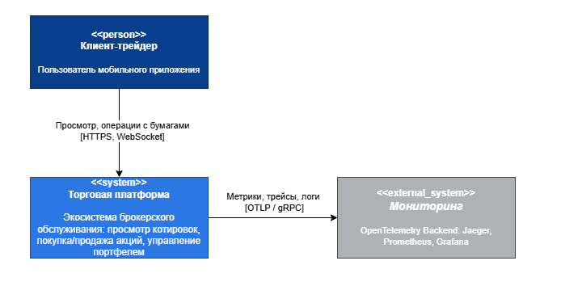{ width=95% }

### Уровень 2. Container

Контейнерная диаграмма раскрывает состав торговой платформы. Клиентский уровень
включает нативное Android-приложение и React Native-приложение. Единой точкой
входа для клиентов выступает API Gateway на Kotlin/Ktor: он принимает REST- и
WebSocket-запросы, маршрутизирует их к сервисам домена и отдаёт котировки.

Backend разделён на сервисы с разной ответственностью. Auth Service отвечает за
пользовательские профили, аутентификацию и сессии. Trade Service выполняет
операции с ордерами, портфелем и балансами. В реализации эти доменные функции
развёрнуты в контейнере Core Banking, а на C4-диаграмме показаны как отдельные
логические сервисы, чтобы явно зафиксировать границу ответственности. Quotes
Service на Go читает поток котировок из Linux-драйвера, записывает историю в
ClickHouse и обновляет горячий кэш Redis/KeyDB. Telemetry Collector агрегирует
телеметрию от сервисов и передаёт её в контур наблюдаемости.

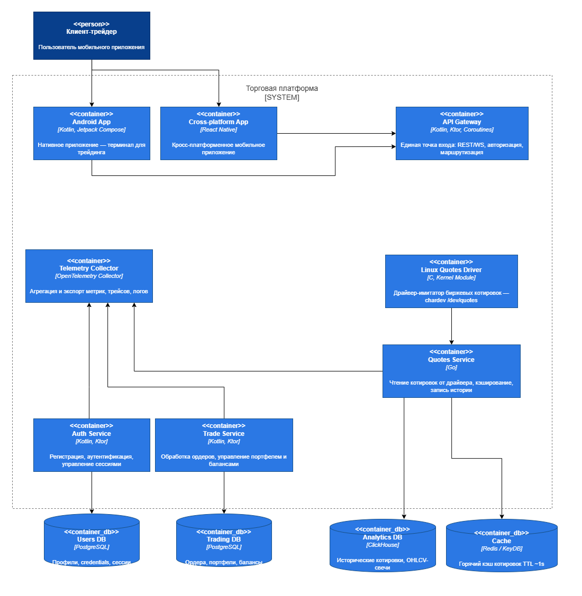{ width=100% }

### Уровень 3. Component

На уровне компонентов детализированы сервисы, которые несут основную
архитектурную нагрузку: API Gateway, Linux Quotes Driver, Quotes Service,
Auth Service и Trade Service.

#### API Gateway

API Gateway состоит из REST Controller, Auth Middleware, Service Router, Rate
Limiter, WebSocket Controller и Redis Subscriber. REST Controller принимает
HTTP-запросы, Auth Middleware проверяет JWT и сессии, Rate Limiter ограничивает
частоту запросов на клиента. Service Router маршрутизирует операции в Auth и
Trade сервисы. WebSocket Controller транслирует котировки клиентам, а Redis
Subscriber подписывается на каналы котировок для push-обновлений.

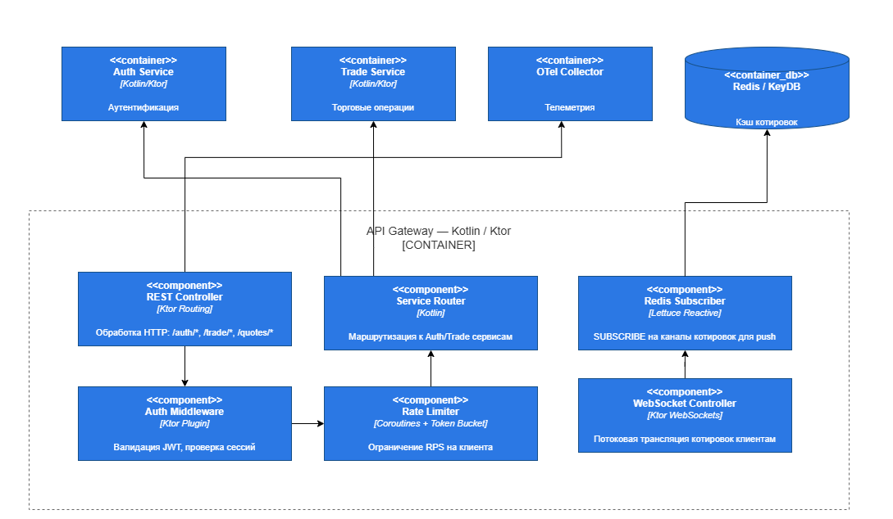{ width=100% }

#### Linux Quotes Driver

Linux Quotes Driver реализован как kernel module на C. Внутри контейнера
выделены Char Device `/dev/quotes`, компонент генерации котировок и кольцевой
буфер. Генератор по таймеру создаёт синтетические котировки, буфер хранит
последние значения, а character device предоставляет пользовательскому
пространству файловый интерфейс `open/read/release/ioctl`.

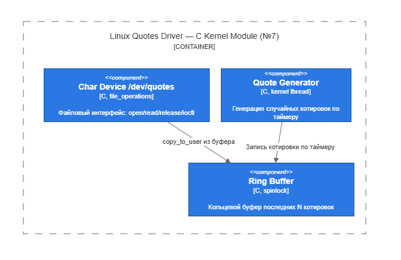{ width=85% }

#### Quotes Service

Quotes Service на Go выполняет потоковую обработку котировок. Device Reader
читает байты из `/dev/quotes`, Quote Parser преобразует бинарные данные в
структуру котировки, Batch Writer пакетно сохраняет историю в ClickHouse, а
Cache Writer обновляет Redis/KeyDB и публикует события по каналам котировок.
Metrics Exporter фиксирует задержки, пропускную способность и ошибки.

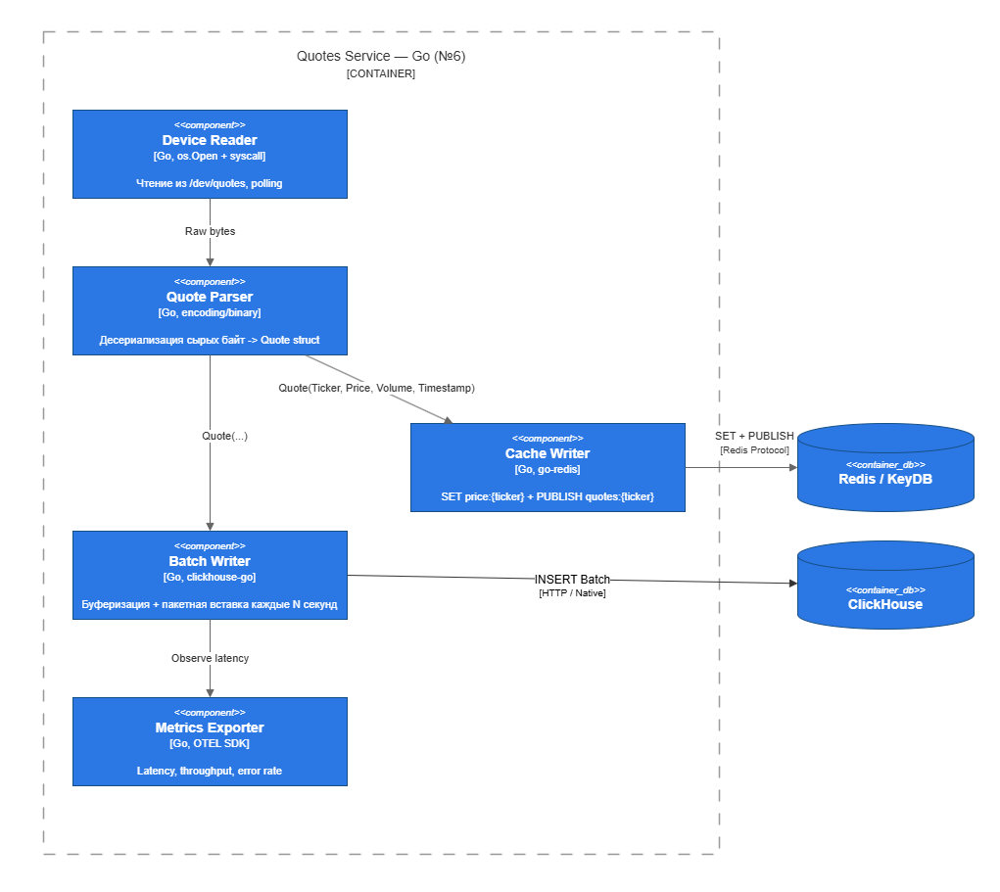{ width=100% }

#### Auth Service

Auth Service обрабатывает регистрацию, вход, обновление токенов и управление
профилем. Auth Controller и User Controller принимают внутренние HTTP-запросы от
API Gateway. Auth Orchestrator координирует регистрацию, проверку учётных
данных, выпуск и отзыв токенов. Token Service работает с JWT, Password Hasher
отвечает за безопасное хеширование паролей, а Session Repository и User
Repository выполняют операции с таблицами `sessions` и `users` в PostgreSQL.

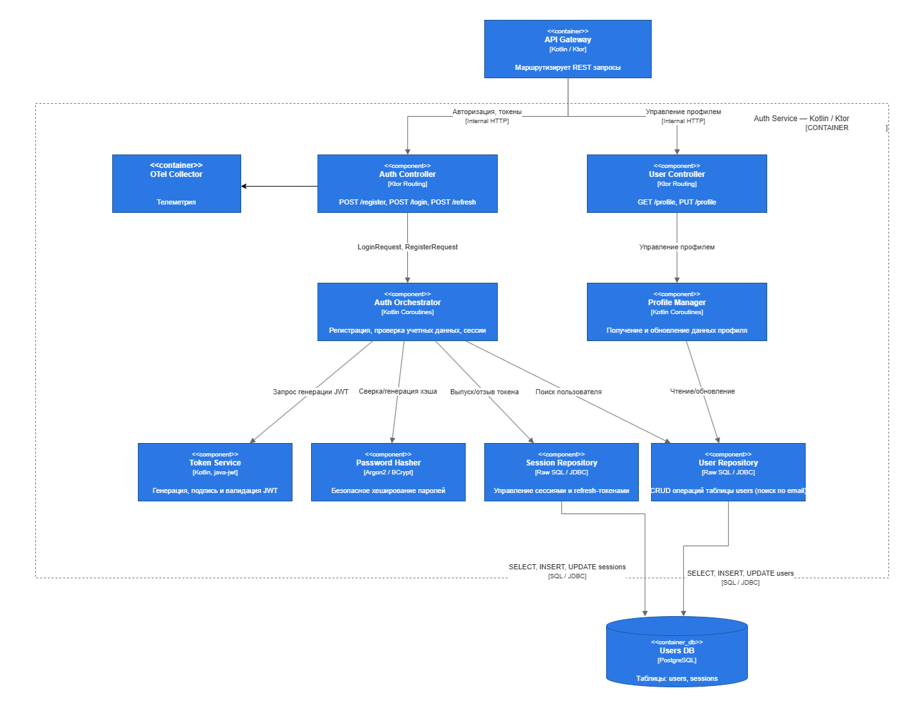{ width=100% }

#### Trade Service

Trade Service отвечает за торговые операции и состояние портфеля. Order
Controller принимает команды создания, чтения и отмены ордеров. Order Processor
валидирует ордер, проверяет баланс и выполняет списание или блокировку средств.
Price Checker получает актуальную цену тикера из Redis/KeyDB. Balance Manager
управляет изменениями баланса, Portfolio Manager рассчитывает позиции, P&L и
среднюю цену входа, а SQL Repository сохраняет ордера, портфели и балансы в
PostgreSQL.

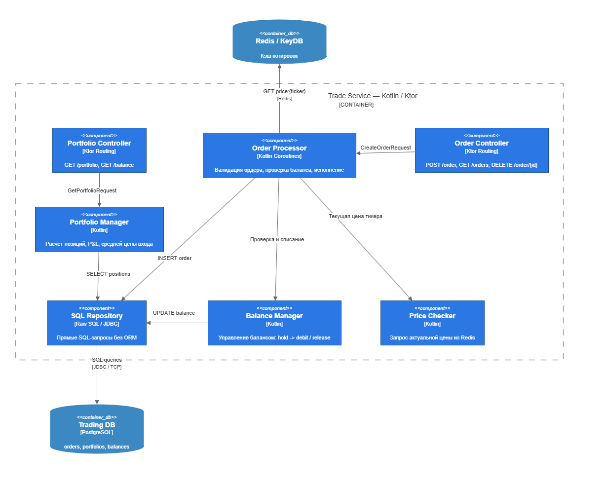{ width=100% }

## Основные потоки данных

Котировки идут по контуру `driver -> ingestion -> ClickHouse -> API Gateway ->
mobile clients`. Для ускорения выдачи текущих данных и WebSocket-уведомлений
используется Redis.

Торговые операции идут по контуру `mobile client -> API Gateway -> Core Banking
-> PostgreSQL`. PostgreSQL выбран для пользовательских данных, потому что
балансы и портфель требуют транзакционной согласованности.

Диаграммы C4 выше фиксируют статическую структуру системы, а потоки данных
показывают, как эти контейнеры взаимодействуют во время выполнения основных
сценариев.

## Хранилища данных

ClickHouse хранит поток котировок и историю цен. PostgreSQL хранит пользователей,
счета, сделки и портфель. Redis используется как кэш и канал Pub/Sub для
уведомления API Gateway о новых котировках.

| Хранилище | Назначение | Причина выбора |
|---|---|---|
| ClickHouse | история котировок | быстрые аналитические выборки по временным рядам |
| PostgreSQL | пользователи, счета, сделки | транзакции и согласованность финансовых данных |
| Redis | кэш и Pub/Sub | быстрые горячие данные и уведомления |

## Архитектурные ограничения

Генерация котировок отделена от бизнес-логики. Сервис ingestion не изменяет
пользовательские данные, а Core Banking не пишет котировки. Такое разделение
уменьшает связанность компонентов и упрощает проверку системы.

# Описание реализации

## Backend

Backend состоит из двух развёртываемых Kotlin/Ktor-сервисов. API Gateway
принимает запросы от мобильных приложений, отдаёт котировки и поддерживает
WebSocket. Core Banking объединяет логические зоны Auth Service и Trade Service:
обрабатывает регистрацию пользователей, пополнение учебного счёта, сделки и
портфель.

Основные endpoints:

| Метод | Маршрут | Назначение |
|---|---|---|
| GET | `/api/quotes` | текущие котировки |
| GET | `/api/quotes/{ticker}/candles` | свечи выбранного тикера |
| WS | `/ws/quotes` | realtime-обновления котировок |
| POST | `/api/users` | создание пользователя |
| POST | `/api/accounts/{userId}/deposit` | учебное пополнение счёта |
| POST | `/api/trades` | покупка или продажа лотов |
| GET | `/api/portfolio/{userId}` | портфель пользователя |

Финансовые операции выполняются в транзакции PostgreSQL. При покупке проверяется
достаточность баланса, при продаже — количество доступных лотов. После проверки
обновляется счёт, портфель и журнал сделок.

## Получение котировок

Драйвер Linux создаёт character device `/dev/quotes` и выдаёт строки с
синтетическими котировками. Go-сервис читает устройство, формирует батчи,
записывает данные в ClickHouse и публикует уведомления о новых котировках в
Redis. Для локальной разработки предусмотрен fallback-режим генерации котировок,
если драйвер недоступен.

## Мобильные приложения

Реализованы два клиента с одинаковым пользовательским сценарием:

- регистрация пользователя;
- просмотр списка котировок;
- просмотр графика выбранного актива;
- пополнение учебного счёта;
- покупка и продажа лотов;
- просмотр портфеля.

Нативное приложение написано на Kotlin и Jetpack Compose. Кросс-платформенное
приложение написано на React Native. Оба клиента работают с одним API, что
позволяет проверять backend независимо от выбранного мобильного стека.

## Развёртывание

Система разворачивается через Docker Compose. В compose-стенд входят backend,
Go ingestion, базы данных, Redis, сервис нагрузочного тестирования и компоненты
наблюдаемости. Для драйвера используется отдельный compose override, так как
kernel module требует доступа к ядру хоста.

## Наблюдаемость

В проекте реализован контур наблюдаемости на базе OpenTelemetry. Kotlin-сервисы
API Gateway и Core Banking экспортируют telemetry-данные через OTLP gRPC на порт
`4317`, а Go ingestion использует OTLP HTTP на порт `4318`. OpenTelemetry
Collector принимает данные от сервисов, отправляет трассы в Jaeger и отдаёт
метрики через Prometheus exporter для последующей визуализации в Grafana.

Для HTTP-взаимодействия между API Gateway и Core Banking используется стандартный
W3C Trace Context: заголовок `traceparent` позволяет связать span-ы одного
пользовательского запроса в общую трассу. Для Redis Pub/Sub propagation не
реализован, поэтому поток `go-ingestion -> Redis -> API Gateway WebSocket`
отображается как несколько независимых trace-ов. Это ограничение допустимо для
учебного стенда и зафиксировано как направление дальнейшего развития.

На рисунке 8 показана трасса операции `POST /api/trades` в Jaeger UI. В ней
виден серверный HTTP-span Core Banking и внутренний span `trade.execute`,
который соответствует выполнению торговой операции и транзакционному обновлению
данных пользователя.

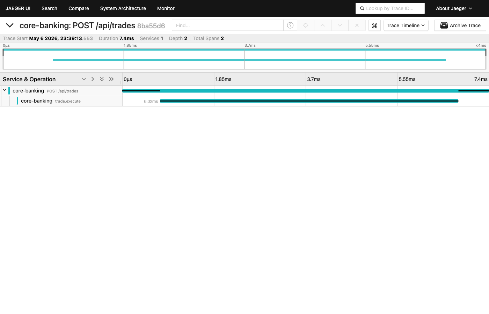{ width=100% }

На рисунке 9 показан список trace-ов Core Banking за последние 15 минут. Такие
trace-ы появляются во время smoke-проверок и нагрузочных прогонов, что
подтверждает прохождение telemetry-данных через OpenTelemetry Collector в
Jaeger.

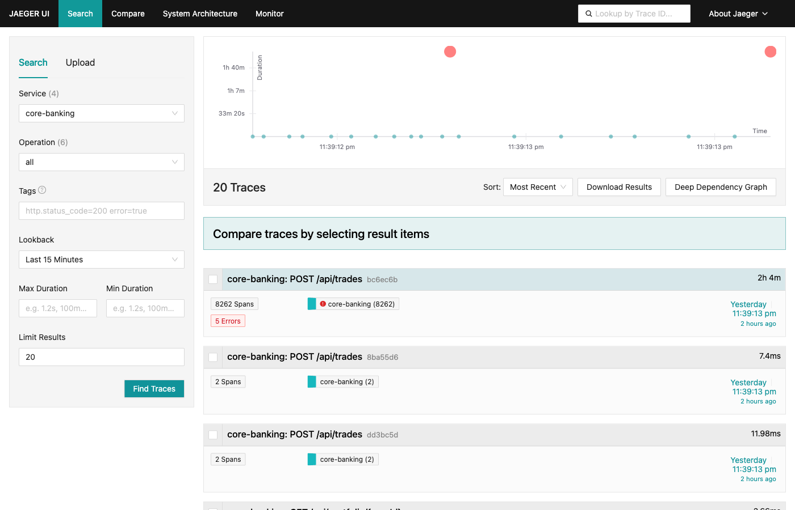{ width=100% }

Grafana подключена к Prometheus и Jaeger через provisioning. На рисунке 10
показан дашборд `HighLoad Invest - Backend Overview`, используемый для контроля
runtime-метрик во время тестов: длительности торговых операций, сообщений Redis
Pub/Sub, WebSocket-рассылки и активности backend-компонентов.

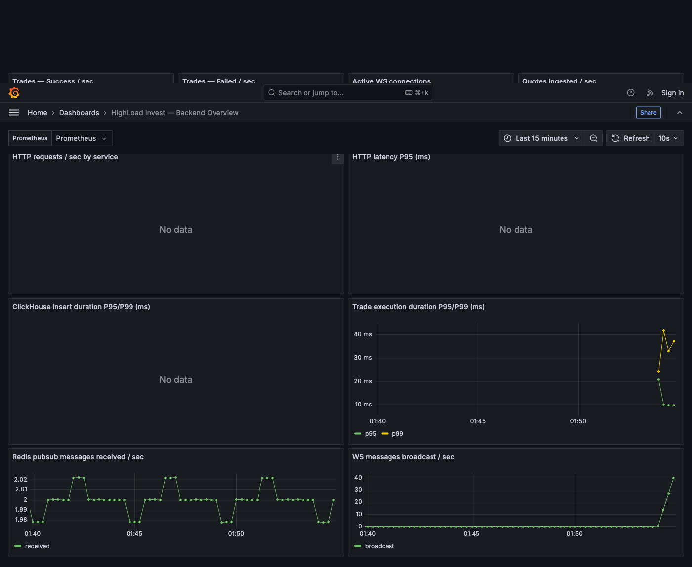{ width=100% }

На рисунке 11 показан список автоматически подготовленных дашбордов Grafana.
Наличие дашборда после запуска стенда подтверждает, что provisioning Grafana
срабатывает без ручной настройки UI.

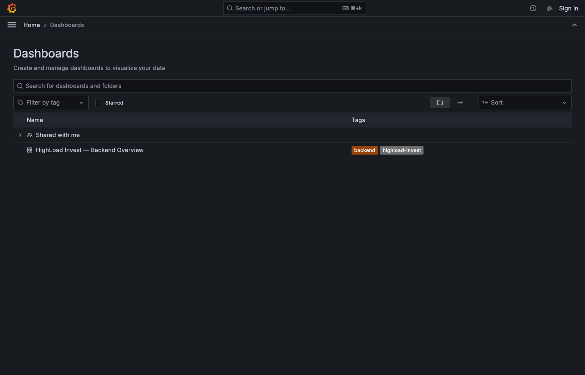{ width=100% }

# Описание системы тестирования

## Проверяемые сценарии

Тестирование было направлено на проверку требований из задания:

- запуск всего стенда через Docker Compose;
- доступность API Gateway и Core Banking;
- получение котировок через REST;
- получение realtime-обновлений через WebSocket;
- регистрация пользователя;
- учебное пополнение счёта;
- покупка лотов;
- проверка портфеля;
- запись котировок из ingestion в ClickHouse;
- работа драйвера Linux через `/dev/quotes`;
- нагрузочная проверка с имитацией большого числа клиентов.

## Smoke-тестирование

Smoke-тест проверяет минимальный пользовательский путь: создание пользователя,
пополнение счёта, покупка актива и чтение портфеля. Успешный результат означает,
что API Gateway, Core Banking и PostgreSQL работают согласованно.

## Проверка котировок

Для проверки потока котировок контролируется три точки: наличие данных в
`/dev/quotes`, рост числа строк в ClickHouse и выдача актуальных котировок через
`GET /api/quotes`. WebSocket проверяется по факту получения клиентом сообщений
из `/ws/quotes`.

## Нагрузочное тестирование

Нагрузочный тест выполняется сервисом-имитатором клиентов
`backend/load-tester`. Он создаёт логических пользователей и отправляет
REST/WebSocket-запросы к API Gateway. Параметры запуска задаются переменными
окружения: `BOT_COUNT`, `DURATION_SEC`, `CREATE_PARALLELISM`,
`ACTIVE_REQUESTS`, `WS_PERCENT`, `REQUEST_DELAY_MIN_MS`,
`REQUEST_DELAY_MAX_MS`.

| Сценарий | Результат |
|---|---|
| Короткая проверка REST и WebSocket | 701 успешный запрос, 0 ошибок, 220 WebSocket-сообщений |
| Проверка 10 000 логических клиентов | 3469 успешных REST-запросов, 0 ошибок |

Полученный результат подтверждает работоспособность стенда при имитации 10 000
логических клиентов. Число одновременно активных запросов ограничивается
параметрами load tester, чтобы тест отражал контролируемую нагрузку, а не
исчерпание ресурсов тестовой машины.

Дополнительно был выполнен каскад прогонов на staging-сервере с конфигурацией
8 vCPU, 16 GB RAM и NVMe. Нагрузка распределялась между основными сценариями:
получение котировок, чтение портфеля и создание торговых операций.

| Боты | Длительность | Всего запросов | Ошибки | Error rate | RPS | Средняя задержка |
|---:|---:|---:|---:|---:|---:|---:|
| 1 000 | 60 с | 20 110 | 0 | 0,00 % | 335 | 24 мс |
| 5 000 | 120 с | 71 544 | 28 | 0,04 % | 594 | 225 мс |
| 10 000 | 120 с | 70 723 | 18 | 0,03 % | 590 | 399 мс |

Перед основной серией запускался baseline на 100 ботах в течение 20 секунд:
2 884 запроса, 0 ошибок, средняя задержка 14 мс, 144 RPS. На максимальном
прогоне host load average составил `25,83 / 18,45 / 8,86`, свободной памяти
оставалось не менее 13 GB.

| Контейнер | CPU | RAM |
|---|---:|---:|
| highload-clickhouse | 35,4 % | 800 MB |
| highload-jaeger | 0,02 % | 398 MB |
| highload-postgres | 0,03 % | 105 MB |
| highload-otel-collector | 0,00 % | 63 MB |
| highload-grafana | 0,04 % | 51 MB |
| highload-prometheus | 0,00 % | 23 MB |
| highload-go-ingestion | 0,27 % | 8 MB |
| highload-redis | 0,63 % | 3 MB |

Основным узким местом оказался ClickHouse: запрос актуальных котировок через
`SELECT ... LIMIT 1 BY ticker` создаёт заметную нагрузку при частом обращении к
`/api/quotes`. Для дальнейшей оптимизации можно использовать Redis-кэш с малым
TTL или materialized view в ClickHouse. PostgreSQL под торговой нагрузкой
оставался стабильным, так как операции распределялись по разным пользователям и
row-level locks не конфликтовали.

Серия прогонов подтверждает выполнение требования по имитации 10 000 клиентов:
на максимальном сценарии система обрабатывала около 590 запросов в секунду,
сохраняла error rate 0,03 %, а средняя задержка оставалась ниже 1 секунды.

## Тестовое инструментальное обеспечение

Для ручных и автоматизированных проверок в проекте используются:

- unit-тесты Core Banking для покупки, продажи, проверки баланса и валидации
  количества лотов;
- Ktor `testApplication` для проверки `/health` API Gateway;
- userspace-тесты драйвера котировок;
- Bruno-коллекция `backend/bruno/highload-invest` для проверки REST-сценариев
  API Gateway и Core Banking;
- smoke-скрипт `backend/scripts/smoke-traffic.sh`, который выполняет короткий
  пользовательский путь и создаёт данные для Grafana/Jaeger;
- load tester `backend/load-tester` для параметризуемых нагрузочных прогонов.

## Проверка сборки мобильных приложений

Для React Native выполнены установка зависимостей и TypeScript-проверка. Для
нативного Android-клиента выполнена сборка debug APK в Docker-образе с Android
SDK. Также собраны установочные APK для проверки на физическом Android-устройстве.
