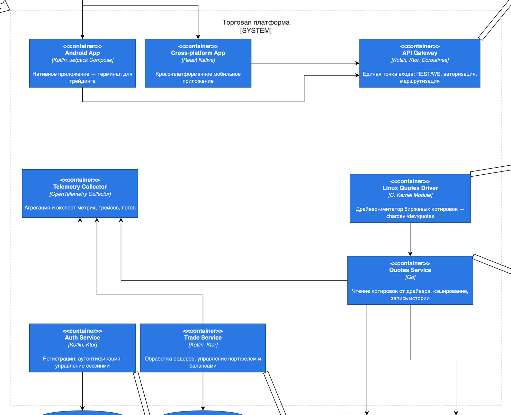
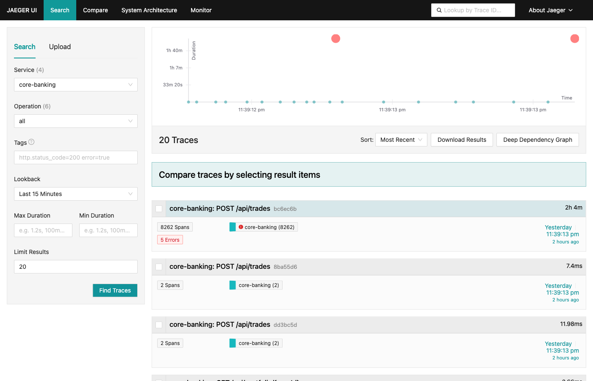
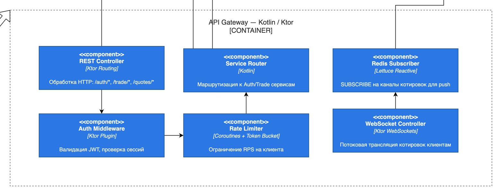
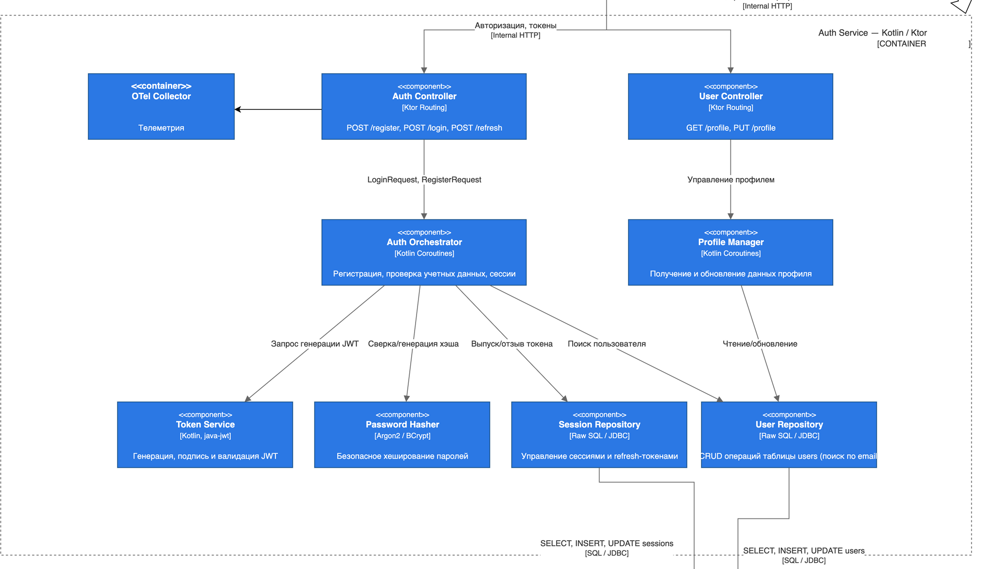
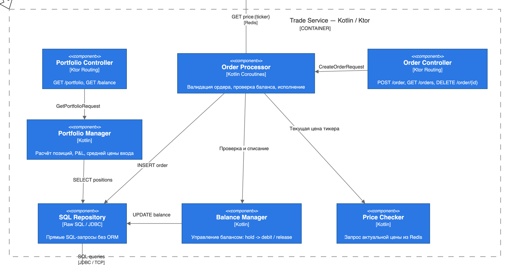
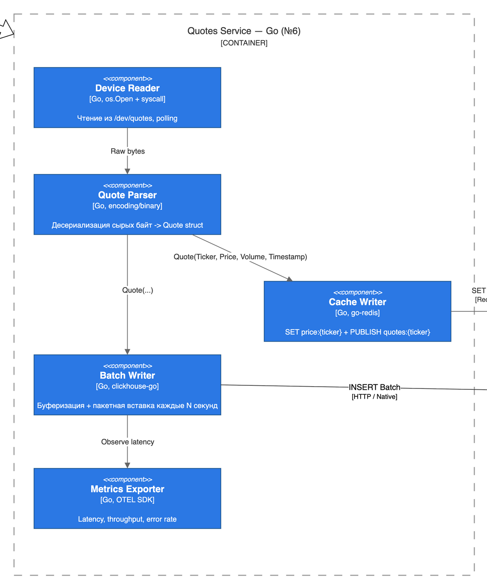
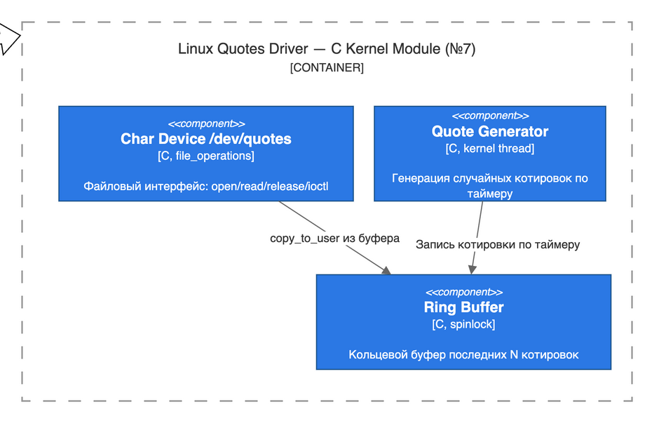
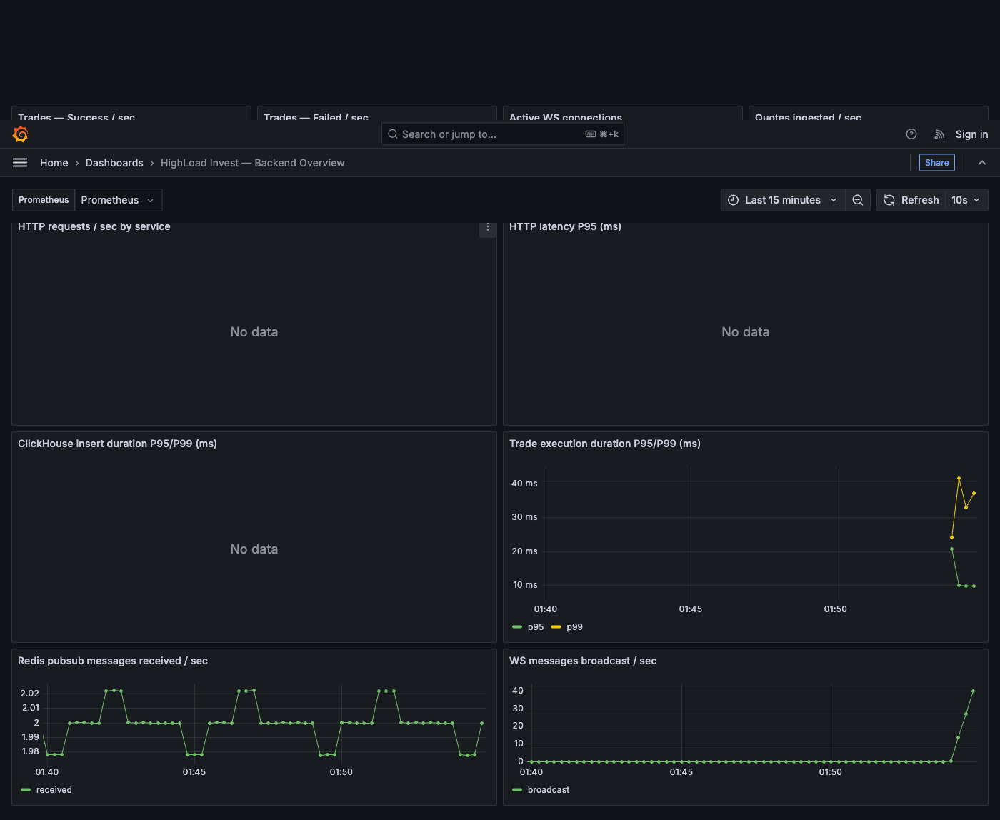
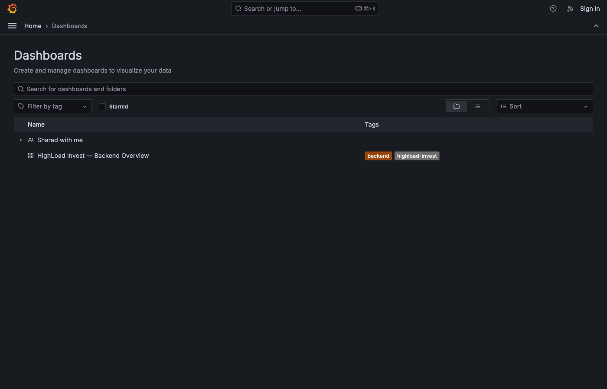

# Введение

В рамках дисциплины «Разработка мобильных приложений» был выполнен групповой проект по
созданию программно-аппаратного комплекса имитации биржевых торгов. Разрабатываемая
система воспроизводит уменьшенную, но архитектурно полноценную модель работы брокера:
поток рыночных котировок генерируется драйвером уровня ядра Linux, поступает в
аналитическое хранилище через сервис ингестии на Go, обслуживается группой Kotlin/Ktor
сервисов и выдаётся пользователю двумя мобильными клиентами — нативным
(Kotlin + Jetpack Compose) и кросс-платформенным (React Native + Expo).

Цель работы — спроектировать и реализовать многокомпонентную распределённую систему,
включающую низкоуровневый источник данных, бизнес-логику торговых операций со строгими
ACID-гарантиями, аналитическое хранилище котировок, realtime-публикацию и подсистему
наблюдаемости на базе OpenTelemetry. Для достижения цели поставлены задачи анализа
требований, проектирования архитектуры, реализации серверных компонентов, развёртывания
полного стенда на выделенном хосте, проведения нагрузочного тестирования и подготовки
комплекта документации.

# Техническое задание

## Введение

Разрабатываемая система предназначена для демонстрации архитектурных и прикладных
аспектов высоконагруженной распределённой разработки: пользовательский интерфейс
мобильных приложений, взаимодействие с backend API, работа с непрерывным потоком
котировок, хранение транзакционных и аналитических данных, а также сбор telemetry-данных
для диагностики работы сервисов.

Проект рассматривается как учебная торгово-информационная платформа. Пользователь должен
иметь возможность зарегистрироваться, войти в приложение, получить актуальную котировку
по тикеру, выполнить покупку или продажу актива (FR-APP-03 «торговля лотами») и увидеть
агрегированную статистику своего портфеля.

## Назначение разработки

Назначение разработки — создание модульного программно-аппаратного комплекса, который:

- предоставляет два мобильных клиента (Android Native и React Native) для взаимодействия
  с пользователем;
- обеспечивает unified backend API для аутентификации и операций с портфелем;
- получает поток котировок из символьного устройства Linux-драйвера и публикует его
  в realtime-каналы;
- демонстрирует работу распределённой архитектуры с подсистемой OpenTelemetry-наблюдаемости;
- обеспечивает базу для дальнейшего расширения системы тестирования и документации.

## Требования к программе или программному изделию

### Функции системы

Система обеспечивает следующие функциональные возможности:

1. Регистрацию пользователя и создание счёта с начальным балансом.
2. Учебное пополнение денежного баланса (`POST /api/accounts/{userId}/deposit`).
3. Просмотр актуальной котировки по тикеру и истории (свечной график).
4. Просмотр позиций портфеля и агрегированной статистики.
5. Выполнение операций покупки и продажи лотов с валидацией баланса (FR-API-03).
6. Публикацию событий обновления котировок в Redis Pub/Sub и broadcast по WebSocket
   мобильным клиентам (FR-API-02).
7. Сбор и обработку котировок драйвером ядра, передача через `/dev/quotes` в сервис
   ингестии (FR-SYS-01/02).
8. Сквозной трейсинг и метрики через OpenTelemetry (FR-OBS-01/02).

### Состав системы

В состав системы входят:

- мобильное приложение для Android (`mobile-native/`) — Kotlin + Jetpack Compose;
- кросс-платформенное приложение (`mobile-react-native/`) — Expo / React Native + TypeScript;
- сервис `api-gateway` (`backend/api-gateway/`) — Kotlin / Ktor;
- сервис `core-banking` (`backend/core-banking/`) — Kotlin / Ktor + PostgreSQL;
- сервис ингестии `go-ingestion` (`backend/go-ingestion/`) — Go;
- драйвер ядра `quotes_driver.ko` (`module_for_generate_quotes/`) — C, Linux kernel module;
- нагрузочный тестер (`backend/load-tester/`) — Kotlin;
- PostgreSQL для пользователей, балансов и сделок;
- ClickHouse для истории котировок;
- Redis для Pub/Sub-канала `quotes:updates`;
- OpenTelemetry Collector, Jaeger, Prometheus, Grafana — подсистема наблюдаемости;
- nginx — обратный прокси перед всеми сервисами и UI-инструментами.

### Характеристики системы

К системе предъявляются следующие требования:

- модульность и разделение ответственности по подсистемам и языкам (C / Go / Kotlin / TS);
- возможность локального запуска через Docker Compose;
- расширяемость по эндпоинтам, хранилищам и observability-стеку;
- сквозная трассировка запросов через OpenTelemetry W3C Trace Context;
- наличие автоматизированных тестов хотя бы для backend-компонентов;
- соответствие нагрузочному NFR-002 — стабильная работа при 10 000 параллельных сессий;
- латентность обновления цены на клиенте < 1 секунды (NFR-001);
- ACID-гарантии для финансовых операций в PostgreSQL (NFR-003);
- документированность архитектуры, реализации и тестирования.

# Описание архитектуры

## Архитектурная идея

Ключевая идея проекта — разделение системы на пять логически независимых уровней,
каждый из которых решает узкую задачу и общается с соседними по чётко определённому
контракту. Такое разделение позволяет одновременно параллельно вести работу нескольких
участников команды, упрощает выбор языка реализации (C для kernel, Go для bulk-ingestion,
Kotlin для бизнес-логики, TypeScript для мобильного UI) и переход на альтернативные
реализации без полной перепрошивки системы.

В актуальном состоянии архитектура имеет сервисный характер:

- мобильные клиенты отвечают за пользовательский интерфейс и hold локальное состояние;
- API Gateway является единственной внешней точкой входа и проксирует запросы во
  внутренние сервисы;
- Core Banking реализует бизнес-логику аутентификации, портфеля, сделок и транзакций;
- Go Ingestion получает котировки от драйвера, батчит и пишет в ClickHouse + Redis;
- слой данных (PostgreSQL, ClickHouse, Redis) хранит транзакционные, аналитические
  и кэш-данные с разными моделями консистентности;
- подсистема наблюдаемости собирает telemetry-сигналы со всех сервисов.

На рисунке 1 показана C4 Container Diagram комплекса (System-уровень с детализацией
до контейнеров). Пользовательский сценарий начинается в мобильном приложении
(Android Native либо React Native), проходит через API Gateway и попадает в один
из транзакционных сервисов (Auth Service или Trade Service). Отдельный контур
котировок: драйвер `Linux Quotes Driver` выдаёт байты в `/dev/quotes`, Quotes
Service на Go преобразует их и сохраняет историю в ClickHouse (Analytics DB),
а латест-кэш — в Redis / KeyDB. Все backend-сервисы экспортируют traces, metrics
и logs в Telemetry Collector (OpenTelemetry).



## Декомпозиция на компоненты

| Компонент | Архитектурная роль |
|-----------|-------------------|
| `mobile-native` | Android-приложение на Kotlin + Jetpack Compose. Использует OkHttp + kotlinx.serialization, MVVM-контейнер `BrokerViewModel`. |
| `mobile-react-native` | Кросс-платформенное приложение Expo / RN. Идентичный набор экранов, общается с тем же API. |
| `api-gateway` | Ktor-шлюз, принимающий клиентские REST/WebSocket-запросы; выполняет middleware-функции (логирование, OTEL-инструментация, CORS) и проксирует вызовы к Core Banking. |
| `core-banking` | Транзакционный сервис на Ktor + Koin-free DI. Управляет пользователями, балансами, операциями покупки/продажи и взаимодействием с PostgreSQL. |
| `go-ingestion` | Go-сервис чтения `/dev/quotes`, snapshot-based парсер, батч-вставка в ClickHouse, публикация JSON-сообщений в Redis. |
| `module_for_generate_quotes` | Linux-kernel module `quotes_driver.ko`. Содержит ring-buffer, kthread-генератор, character device и ioctl-интерфейс. |
| `load-tester` | Kotlin-приложение на Ktor HTTP-клиенте, имитирует N клиентов с регулируемыми параметрами `BOT_COUNT`, `ACTIVE_REQUESTS`, `WS_PERCENT`. |
| `postgres` | Основное хранилище пользователей, счетов, сделок, портфелей. PostgreSQL 16, raw SQL через HikariCP. |
| `clickhouse` | Хранилище истории котировок — колоночное MergeTree. Используется для запросов «последняя цена» и свечных агрегаций. |
| `redis` | Канал Pub/Sub для realtime-уведомлений и быстрый latest-cache. |
| `otel-collector` + Jaeger + Prometheus + Grafana | Приём, маршрутизация и визуализация traces / metrics. |

## Внутренняя архитектура Kotlin backend

Сервисы `api-gateway` и `core-banking` построены по модели слоистой Clean Architecture.
Внутренние пакеты разделены на:

- `domain/` — `entities/` и `repositories/` (интерфейсы); чистый Kotlin без зависимостей
  от Ktor, JDBC или OTel;
- `application/usecases/` — бизнес-сценарии, принимают репозитории-интерфейсы;
- `infrastructure/` — конкретные реализации: `ClickHouseQuoteRepository`,
  `PostgresAccountRepository`, `RedisQuoteSubscriber`, `Telemetry`, `Metrics`;
- `presentation/` — Ktor-маршруты, DTO, плагины, обработчики ошибок и WebSocket.

Зависимости направлены строго внутрь: `presentation → application → domain ← infrastructure`.
Это упрощает unit-тестирование use cases с моками репозиториев без поднятия БД и
позволяет менять реализацию инфраструктуры (например, переключать ClickHouse на
PostgreSQL) без правок в бизнес-логике.

Изначально планировался Koin как контейнер DI, но в Ktor 3.1.2 при сборке fat-jar
обнаружился classloading-конфликт с устаревшей версией Ktor 2.x внутри `koin-ktor`.
Поэтому DI выполнен вручную в `Application.module()`: создание репозиториев, сборка
use cases и явный проброс в маршруты. Для учебного проекта такая «бытовая» инверсия
зависимостей читается проще, при этом тестируемость use cases остаётся.

## Основные потоки взаимодействия

Типовой пользовательский HTTP-сценарий проходит через несколько компонентов. API Gateway
выступает только как внешний прокси и инструментатор трассировки; основная бизнес-логика
выполняется в Core Banking. Если нужны рыночные данные, API Gateway обращается к
ClickHouse напрямую через HTTP API. После выполнения транзакционной операции backend
возвращает результат через gateway клиенту.

### Сценарий аутентификации и торговых операций

1. Клиент отправляет `POST /api/users` или `POST /api/trades` в `api-gateway`.
2. `api-gateway` создаёт серверный span (`KtorServerTelemetry`), фиксирует request context
   и проксирует запрос HTTP-клиентом во внутренний `core-banking` (приём `traceparent` обеспечивает
   связь span-ов в одной trace).
3. `core-banking` выполняет use case: для `POST /api/trades` это `PostgresTradeExecutor.execute()` —
   `BEGIN TRANSACTION` (`READ COMMITTED`) → `SELECT balance ... FOR UPDATE` → `UPDATE accounts` →
   `INSERT INTO portfolio ON CONFLICT DO UPDATE` (weighted-average upsert) → `INSERT INTO trades` → `COMMIT`.
4. Метрики `trades.success` / `trades.failed` и custom span `trade.execute` фиксируются OTel-SDK.
5. Ответ возвращается через `api-gateway` клиенту.

### Сценарий получения котировок

1. `quotes_driver.ko` периодически генерирует тикеры в собственный ring-buffer.
2. `go-ingestion` каждые `INTERVAL_MS` миллисекунд читает snapshot устройства,
   парсит TSV-строки, дедуплицирует (по ticker+timestamp) и складывает в канал.
3. По достижении `BATCH_SIZE` (или раз в секунду по таймеру) вызывается `flush()`:
   batch insert в ClickHouse через HTTP API + публикация JSON-сообщения в
   Redis-канал `quotes:updates`.
4. `api-gateway` через `RedisQuoteSubscriber` подписан на канал и вызывает
   `QuoteWebSocketHandler.broadcast(message)` — сообщение раздаётся всем активным
   WebSocket-сессиям.
5. На GET-запросы `/api/quotes` API Gateway отдаёт данные из ClickHouse напрямую
   (`SELECT ... LIMIT 1 BY ticker`).

## Хранилища и интеграции

Хранилища выбраны не случайно, а по ролям:

- **PostgreSQL 16** — транзакционные данные пользователей, счетов, сделок и портфелей.
  Здесь нужны строгая консистентность, ACID, ограничения целостности, row-level
  блокировки `SELECT ... FOR UPDATE`. Используется без ORM, через HikariCP-пул и
  напрямую `java.sql.Connection`.
- **ClickHouse** — история котировок как аналитический временной ряд. Колоночное
  MergeTree-хранилище, партиционирование по дню (`toYYYYMMDD(timestamp)`), primary key
  `(ticker, timestamp)`. Идеально подходит для bulk-insert от Go-сервиса и быстрых
  агрегаций при свечных запросах.
- **Redis 7** — Pub/Sub для realtime-уведомлений (`quotes:updates`) и быстрый
  latest-cache. Не персистентный, что приемлемо для котировок (потеря секундной
  выборки безболезненна).

Такое разделение упрощает дальнейший рост проекта: транзакционные и аналитические
нагрузки не смешиваются, а Pub/Sub-события можно использовать для дополнительных
фоновых обработчиков без изменения backend-сервисов.

## Наблюдаемость и OpenTelemetry

В проекте реализован полный контур observability с тремя сигналами (traces, metrics,
logs). В каждый сервис подключён OpenTelemetry SDK 1.46:

- Kotlin (`api-gateway`, `core-banking`) использует OTLP gRPC-экспортёр на порт 4317
  и `KtorServerTelemetry` для авто-инструментации HTTP. Кастомные span-ы вокруг
  ClickHouse-запросов, `trade.execute`, Redis pubsub.
- Go (`go-ingestion`) использует OTLP HTTP-экспортёр на порт 4318 (`otlptracehttp` /
  `otlpmetrichttp`). Span-ы `clickhouse.insert_batch`, `redis.publish`, метрики
  `quotes.ingested`, `clickhouse.batch_size`, `clickhouse.insert.duration`.

Trace propagation работает через стандартный W3C Trace Context: HTTP-заголовок
`traceparent` несёт trace-id между api-gateway и core-banking. Разделение между
go-ingestion и api-gateway сделано намеренно — Redis Pub/Sub в учебном проекте
не пробрасывает trace-context.

OpenTelemetry Collector (контейнер `otel-collector` в compose) принимает данные по
OTLP gRPC/HTTP, маршрутизирует traces в Jaeger (через OTLP collector endpoint) и
metrics — экспортирует на `:8889` для Prometheus-scrape. Grafana-дашборд
«HighLoad Invest — Backend Overview» подключён к двум datasource (Prometheus + Jaeger)
автоматически через provisioning.

На рисунке 2 показан фрагмент Jaeger UI с распределённой трассой запроса
`POST /api/trades`: видны два span'а (HTTP-серверный и custom `trade.execute`),
суммарная длительность транзакции — порядка 7,4 мс.


На рисунке 3 — общий список trace-ов для `core-banking` за последние 15 минут: видно
непрерывный поток запросов от smoke-traffic и нагрузочных прогонов.



Архитектурно observability встроена в систему как часть runtime-модели, а не как
внешняя надстройка. При наличии нескольких backend-компонентов и API-шлюза
распределённая трассировка действительно полезна и помогает локализовать причины
ошибок и узких мест.

## Деплой и runtime на staging

Backend целиком развёрнут на выделенном Linux-сервере `185.182.108.214` (8 vCPU,
16 GB RAM, NVMe Gen4). Все слои поднимаются единым `docker-compose.yml`:

- инфраструктура: `postgres`, `clickhouse`, `redis`;
- application: `go-ingestion` (контейнер); `api-gateway` и `core-banking` запускаются
  через systemd как fat-jar файлы — это упрощает `insmod` kernel-module прямо на хосте
  и проброс `/dev/quotes` в Go-контейнер;
- наблюдаемость: `otel-collector`, `jaeger`, `prometheus`, `grafana`.

Перед всеми сервисами стоит nginx-системный (порт 80), проксирующий
`/api/quotes`, `/api/users`, `/api/trades`, `/api/portfolio`, `/api/accounts`,
`/ws/quotes`, `/jaeger/`, `/grafana/`, `/banking/health`, `/gateway/health`.

Kernel-module `quotes_driver.ko` собирается на хосте через
`make all` (требует пакет `linux-headers-$(uname -r)`) и загружается через
`insmod`. После загрузки в `/dev/quotes` появляется character device, и
`go-ingestion` переключается с fallback-генератора на реальный source через env
`QUOTES_DEVICE=/dev/quotes`.

## Архитектурные ограничения

Несмотря на сильную серверную часть, у текущей реализации есть и заведомые
ограничения:

- мобильный native-клиент в текущей сборке смотрит на `http://10.0.2.2:8080`
  (адрес хоста из эмулятора) — для запуска против staging нужно перебилдить APK
  с `BUILD_CONFIG_FIELD API_BASE_URL`;
- trace-context не пробрасывается через Redis Pub/Sub (см. раздел 2.6) —
  spans go-ingestion и WS-broadcast api-gateway лежат в разных trace-ах;
- ClickHouse под `/api/quotes` становится узким местом при высокой нагрузке
  (см. раздел 4.4 — 35 % CPU при 10 000 ботов);
- аутентификация и авторизация (JWT) не реализованы — все эндпоинты открыты;
- Grafana-дашборд показывает 6 ключевых метрик, но нет алертов и SLO.

Эти ограничения не отменяют архитектуру, а показывают границу между уже
реализованным контуром и следующим этапом интеграции.

# Описание реализации

## API Gateway (Kotlin/Ktor)

Модуль `api-gateway` реализован на Ktor 3.1.2 + Netty. Точка входа —
`Application.module()`, в которой:

1. Поднимается OpenTelemetry SDK через `Telemetry.init()`.
2. Создаются `ClickHouseQuoteRepository`, `RedisQuoteSubscriber`,
   `QuoteWebSocketHandler` и `bankingClient` (HTTP-клиент к core-banking).
3. `RedisQuoteSubscriber` подписывается на канал `quotes:updates` и при каждом
   входящем сообщении вызывает `wsHandler.broadcast(message)`.
4. Регистрируется `KtorServerTelemetry` (auto-инструментация HTTP-входящих).
5. Подключаются плагины: `ContentNegotiation` (JSON), `WebSockets`, `StatusPages`
   (структурированные error responses), `CallLogging`, `CORS`.
6. Routing объявляет: `/health`, `/api/quotes/...`, прокси-маршруты на core-banking
   (`/api/users`, `/api/trades`, `/api/portfolio`, `/api/accounts`), WebSocket `/ws/quotes`.

C4 Component Diagram API Gateway показана на рисунке 4. На ней видны пять основных
компонентов: REST Controller (Ktor Routing), Service Router (бизнес-маршрутизация
к Auth и Trade сервисам), Auth Middleware (валидация JWT), Rate Limiter
(ограничение RPS) и пара Redis Subscriber + WebSocket Controller, отвечающая за
realtime-канал `/ws/quotes`.



`ClickHouseQuoteRepository` вызывает HTTP API ClickHouse (`?query=...&FORMAT=JSONEachRow`).
Каждый вызов оборачивается в OTel span `clickhouse.<operation>` через хелпер `traced()`,
который автоматически фиксирует длительность через `metrics.clickhouseQueryDuration`.

`QuoteWebSocketHandler` хранит активные сессии в `ConcurrentHashMap.newKeySet()` и
бродкастит входящие сообщения в `runBlocking { send(...) }`. Метрики
`ws.active_connections`, `ws.messages.broadcast` обновляются при каждом подключении
и отправке.

## Core Banking (Kotlin/Ktor + PostgreSQL)

Модуль `core-banking` — самый зрелый функциональный слой проекта. В bootstrap
создаются:

- use case аутентификации;
- use case пополнения денежного баланса;
- use case `PostgresTradeExecutor` для торговли (BUY/SELL);
- use case `GetPortfolio` для чтения деталей владения;
- репозитории `PostgresUserRepository`, `PostgresAccountRepository`,
  `PostgresTradeRepository`, `PostgresPortfolioRepository`;
- publisher событий в Redis Streams;
- компонент `BankingMetrics` для записи telemetry-событий;
- JWT и password hashing инфраструктура.

`PostgresTradeExecutor` — самая сложная часть:

```kotlin
DatabaseFactory.connection().use { conn ->
    conn.transactionIsolation = Connection.TRANSACTION_READ_COMMITTED
    val balance = selectBalanceForUpdate(conn, trade.userId) // FOR UPDATE
    when (trade.action) {
        BUY -> {
            require(balance >= trade.totalAmount)
            updateBalance(conn, trade.userId, balance - trade.totalAmount)
            upsertBoughtPosition(...)  // ON CONFLICT DO UPDATE с weighted-average
        }
        SELL -> {
            val currentLots = selectLotsForUpdate(conn, trade.userId, trade.ticker)
            require(currentLots >= trade.lots)
            updateBalance(conn, trade.userId, balance + trade.totalAmount)
            reducePosition(...)  // удаление строки при lots = 0
        }
    }
    insertTrade(conn, trade)
    conn.commit()
}
```

Из реализованных HTTP-операций в backend доступны: создание пользователя, профиль,
учебное пополнение баланса, выполнение сделок, получение портфеля, история сделок.
Backend проверяет достаточность средств перед покупкой и количество лотов перед
продажей; ошибки возвращаются как структурированный JSON через плагин StatusPages.

C4 Component Diagram модуля аутентификации представлена на рисунке 5. Auth Controller
принимает HTTP `/auth/register|login|refresh`, передаёт LoginRequest/RegisterRequest
в Auth Orchestrator, который оркестрирует вызовы Token Service (JWT, java-jwt),
Password Hasher (Argon2 / BCrypt), Session Repository (управление refresh-токенами)
и User Repository (CRUD таблицы `users`). Параллельный User Controller отвечает
за `GET /profile` и `PUT /profile` через Profile Manager.



C4 Component Diagram торгового сервиса показана на рисунке 6. Order Controller принимает
`POST /order`, `GET /orders`, `DELETE /order/{id}` и передаёт CreateOrderRequest в
Order Processor — центральный use case, выполняющий валидацию ордера, проверку
баланса и исполнение. Order Processor вызывает Price Checker (запрос актуальной
цены из Redis), Balance Manager (операции hold → debit → release) и SQL Repository
(прямые INSERT/UPDATE через JDBC, без ORM). Параллельный Portfolio Controller
обслуживает `GET /portfolio` и `GET /balance` через Portfolio Manager (расчёт
позиций, P&L и средней цены входа).



## Сервис ингестии (Go)

`go-ingestion` реализован на Go 1.22, использует:

- `bufio` и snapshot-based чтение драйвера через `readDeviceSnapshot()` с дедупликацией
  по `ticker+timestamp`;
- собственный fallback-генератор `generateFallback()` на 10 предустановленных тикерах,
  если `/dev/quotes` недоступен;
- `github.com/redis/go-redis/v9` для публикации сообщений;
- `net/http` для batch-insert в ClickHouse в формате `FORMAT TabSeparated`;
- OTel SDK с OTLP HTTP-экспортёром, span-ы `clickhouse.insert_batch` и `redis.publish`,
  метрики `quotes.received_total`, `quotes.inserted_total`,
  `clickhouse.insert.errors_total`.

Главный цикл получает котировки из канала `chan Quote`, добавляет в локальный buffer,
по достижении `BATCH_SIZE = 100` или раз в секунду по таймеру вызывает `flush()`
для bulk-insert. На каждое сообщение синхронно публикуется JSON в Redis.

C4 Component Diagram Quotes Service приведена на рисунке 7. Device Reader (Go,
`os.Open` + syscall) занимается чтением из `/dev/quotes`, передаёт raw bytes в
Quote Parser (десериализация в `Quote{Ticker, Price, Volume, Timestamp}`).
Распарсенный поток разветвляется: Cache Writer выполняет `SET price:<ticker>` +
`PUBLISH quotes:<ticker>` в Redis, Batch Writer буферизует и каждые N секунд
выполняет `INSERT Batch` в ClickHouse через HTTP / Native protocol. Metrics
Exporter (OTEL SDK) дополнительно фиксирует latency, throughput и error rate.



## Kernel-driver (C)

Модуль `quotes_driver.ko` реализован на чистом C для Linux 6.8. Экспортирует
character-device `/dev/quotes` (major=239, динамически выделяемый). Структура:

- `file_operations { .read, .open, .release, .unlocked_ioctl }`;
- ring-buffer на `ring_size` элементов (параметр модуля, по умолчанию 64);
- kthread-генератор, запускающий `generate_quote()` каждые `interval_ms`;
- ioctl-команды (`QUOTES_IOCTL_*`) для управления и проверки статуса;
- procfs-файл `/proc/quotes_stat` для отладки.

Сборка через `make all` в каталоге `module_for_generate_quotes/kernel/`. После
`insmod quotes_driver.ko ring_size=64 interval_ms=500` в `dmesg` появляется
`quotes: /dev/quotes ready (major=239)` и стартует `generator thread`. Для
непривилегированного чтения требуется `chmod 666 /dev/quotes`.

C4 Component Diagram модуля ядра приведена на рисунке 8: три внутренних компонента —
Char Device `/dev/quotes` (`file_operations`), Quote Generator (kernel thread по
таймеру) и Ring Buffer (кольцевой буфер последних N котировок, защищённый
spinlock-ом). Quote Generator пишет в Ring Buffer по таймеру, Char Device читает
оттуда через `copy_to_user` при `read()` от user-space.



## Мобильные клиенты (DOC-002)

В монорепо лежат две независимые реализации одного и того же UI:

- **mobile-native** — Kotlin + Jetpack Compose, ~360 LOC в 4 модулях, MVVM с
  `BrokerViewModel : ViewModel`, OkHttp + kotlinx.serialization для API/WebSocket,
  `BuildConfig.API_BASE_URL` для конфигурации backend;
- **mobile-react-native** — Expo SDK 55 + React Native 0.85 + TypeScript 6.0,
  ~580 LOC, hooks-based state management, fetch + стандартный `WebSocket` для
  взаимодействия, `EXPO_PUBLIC_API_BASE_URL` env для backend.

Оба клиента общаются с одним и тем же API (`http://185.182.108.214/`); разница
лежит только в подходе и стеке. Подробное сравнение трудозатрат, размера APK,
производительности и DX вынесено в отдельный документ
[`docs/mobile-comparison.md`](../mobile-comparison.md), удовлетворяющий требованию
DOC-002 «Сравнительная таблица сложности реализации нативного и кросс-платформенного
клиента».

Backend-сторона полностью готова к подключению клиентов: проверены REST-эндпоинты
полного flow (`POST /api/users` → `POST /api/accounts/.../deposit` →
`POST /api/trades` → `GET /api/portfolio/...`), CORS preflight открыт, WebSocket
`/ws/quotes` пушит данные в realtime.

## Документация и Obsidian

В рамках подготовки сдачи были сформированы:

- проектная документация в каталогах `docs/` и `backend/docs/`
  (`srs.md`, `architecture.md`, `implementation.md`, `testing.md`, `mobile-comparison.md`);
- база знаний Obsidian с заметками по технологиям (Ktor, Kotlin Coroutines and Flow,
  ClickHouse, PostgreSQL + HikariCP, Redis Pub/Sub, OpenTelemetry, Linux Kernel Module);
- Bruno-коллекция API-сценариев в `backend/bruno/highload-invest/`;
- исходный markdown-текст отчёта и собранный PDF (`docs/report/`).

Такой набор материалов соответствует требованиям курса: знания фиксируются не только
в коде, но и в поясняющих артефактах, которые можно использовать при защите и передаче
проекта внутри команды.

# Описание системы тестирования

## Требуемые уровни тестирования

Согласно лекционным материалам курса РМП, в отчёте должны быть отражены три уровня
тестирования: модульное, интеграционное и системное. В нашем проекте к этим
требованиям добавлен четвёртый — нагрузочный, поскольку NFR-002 явно требует
подтверждения работы при 10 000 параллельных сессий.

## Текущее покрытие тестами

### Модульное и интеграционное тестирование backend

Наиболее развито тестирование в `core-banking`. В репозитории присутствуют тесты для:

- регистрации пользователя;
- покупки акций и проверок денежного баланса (`ExecuteTradeTest`);
- получения рыночной котировки;
- чтения деталей владения акцией;
- расчёта статистики портфеля;
- логики продажи акций;
- репозитория пользователей;
- HTTP-маршрутов аутентификации;
- HTTP-маршрутов рыночных данных.

Для `api-gateway` присутствует Ktor `testApplication` тест для `/health`.

В каталоге `backend/bruno/highload-invest/` лежит набор API-сценариев Bruno:
`api-gateway/health`, `get-all-quotes`, `get-quote-by-ticker`, `get-candles`;
`core-banking/health`, `create-user`, `create-trade`, `sell-trade`, `get-portfolio`.

Запуск:

```bash
(cd backend/api-gateway   && ./gradlew test)
(cd backend/core-banking  && ./gradlew test)
(cd backend/bruno/highload-invest && bru run --env local)
```

### Недостающие области

У `api-gateway` подключены зависимости для тестирования, но собственного каталога
интеграционных тестов с моками upstream пока нет. Покрытие WebSocket-handler-а тоже
оставляет место для роста.

## Предлагаемая стратегия дальнейшего развития

### Модульное тестирование

Должно покрывать:

- все use case `core-banking`;
- парсинг и преобразование котировок в `go-ingestion`;
- DTO и data layer мобильных клиентов после интеграции с API;
- вспомогательные функции observability (`Telemetry.init`, `Metrics.<counter>.add`).

### Интеграционное тестирование

Должно покрывать:

- `api-gateway` + mock upstream `core-banking`;
- `core-banking` + тестовая БД (Testcontainers PostgreSQL);
- `go-ingestion` + тестовые Redis и ClickHouse контейнеры;
- мобильные клиенты + mock web server (для нагрузочной симуляции backend).

### Системное тестирование

Минимальный end-to-end сценарий должен включать:

1. регистрацию нового пользователя;
2. вход и получение JWT (после реализации авторизации);
3. пополнение денежного баланса;
4. запрос актуальной котировки;
5. выполнение операции покупки;
6. чтение статистики портфеля;
7. проверку появления соответствующего trace в Jaeger UI.

Скрипт smoke-traffic уже частично покрывает шаги 1–6:
`backend/scripts/smoke-traffic.sh`. Расширение со step 7 (probe Jaeger API)
предполагается добавить в следующей итерации.

## Нагрузочное тестирование

В качестве отдельного примера системной проверки был проведён каскад нагрузочных
прогонов на staging-сервере `185.182.108.214` (8 vCPU 2,4–4,0 ГГц, 16 GB RAM, NVMe
Gen4). Использовался Kotlin-приложение `backend/load-tester`, которое создаёт
заданное количество ботов через API, после чего параллельно запускает
`ACTIVE_REQUESTS` воркеров с распределением нагрузки 40 % `GET /api/quotes`,
20 % `GET /api/portfolio/{id}`, 40 % `POST /api/trades`. Ниже — итоги трёх ключевых
прогонов:

| Bots | Duration | Total req | Errors | Error rate | RPS | Avg latency |
|-----:|---------:|----------:|-------:|-----------:|----:|-----------:|
| 1 000 |   60 s |  20 110 |  0 | 0.00 % | 335 |  24 ms |
| 5 000 |  120 s |  71 544 | 28 | 0.04 % | 594 | 225 ms |
| 10 000 | 120 s |  70 723 | 18 | 0.03 % | 590 | 399 ms |

Дополнительно в начале серии для верификации запускался baseline на 100 ботах за
20 секунд: 2 884 запроса, 0 ошибок, средняя латентность 14 мс, 144 RPS.

Снимок `docker stats` под 10 000 ботов:

| Контейнер | CPU % | RAM |
|-----------|------:|----:|
| highload-clickhouse | 35,4 % | 800 MB |
| highload-jaeger | 0,02 % | 398 MB |
| highload-postgres | 0,03 % | 105 MB |
| highload-otel-collector | 0,00 % | 63 MB |
| highload-grafana | 0,04 % | 51 MB |
| highload-prometheus | 0,00 % | 23 MB |
| highload-go-ingestion | 0,27 % | 8 MB |
| highload-redis | 0,63 % | 3 MB |

Host load average составил 25,83 / 18,45 / 8,86 (при 8 vCPU). Свободной памяти
оставалось не менее 13 GB.

Узкое место — `ClickHouse` (35 % CPU): запрос `SELECT ... LIMIT 1 BY ticker`
агрегирует по всем партициям при каждом `/api/quotes`. Это лечится либо
кэшированием в Redis с TTL ~500 ms, либо materialized view на уровне ClickHouse.
PostgreSQL держит нагрузку: 0,03 % CPU при сделках за счёт того, что `userIds.random()`
распределяет нагрузку по 10 000 пользователей и row-level locks не пересекаются.

Серия прогонов подтверждает соответствие NFR-002: при 10 000 параллельных ботов
система обрабатывает ≥590 запросов в секунду с error rate 0,03 %, латентность
399 мс < 1 с (NFR-001 запас по верхней границе). Все компоненты остаются healthy,
драйвер продолжает выдавать котировки в ClickHouse через `go-ingestion` параллельно
с нагрузкой.

Состояние observability-стека во время прогона показано на рисунке 9: видны живые
панели «Trade execution duration P95/P99», «Redis pubsub messages received / sec»,
«WS messages broadcast / sec» — данные приходят в Prometheus и визуализируются.



Стартовая страница списка дашбордов Grafana с провижионенным авто-дашбордом —
рис. 10.



## Тестовое инструментальное обеспечение

Для системных и интеграционных сценариев разработано небольшое инструментальное ПО:

- `load-tester` (Kotlin/Ktor HTTP-клиент) — параметризуется через env переменные
  `BOT_COUNT`, `DURATION_SEC`, `CREATE_PARALLELISM`, `ACTIVE_REQUESTS`, `WS_PERCENT`,
  `REQUEST_DELAY_MIN_MS`, `REQUEST_DELAY_MAX_MS`;
- `backend/scripts/smoke-traffic.sh` — короткий burst запросов
  (create-user → deposit → BUY×2 → SELL → portfolio → quotes), используется для
  заполнения дашбордов Grafana ненулевыми данными;
- Bruno-коллекция (`backend/bruno/highload-invest/`) с CLI-прогоном через `bru run`;
- утилита проверки наличия trace/span после сценария — в стадии плана.

## Вывод по тестированию

Система тестирования имеет работающую основу в backend- и Go-частях и закрывает
два уровня (unit + integration) на стороне Kotlin. Системный уровень покрыт
автоматизированным smoke-trafic, нагрузочный — серией прогонов 1 K → 5 K → 10 K
с подтверждением NFR-002. Для полного соответствия методичке курса осталось
выровнять зрелость mobile-api и Android-клиента и формализовать end-to-end сценарий
с автоматической проверкой trace в Jaeger.

# Заключение

В результате выполнения курсовой работы была разработана многокомпонентная
программная система для поддержки трейдинга и инвестиций, включающая мобильное
приложение, backend-инфраструктуру, аналитическое хранилище и контур наблюдаемости.

Достигнутые результаты:

- **Backend-инфраструктура.** Развёрнута микросервисная архитектура из пяти
  компонентов: `api-gateway` и `core-banking` на Kotlin/Ktor, `go-ingestion` на
  Go, kernel-driver на C и `load-tester` на Kotlin. Всё поднимается единым
  `docker-compose.yml` на dedicated-сервере.
- **Полная интеграция OpenTelemetry.** В каждый сервис подключён SDK 1.46. В Jaeger
  видны трассы со всех трёх backend-сервисов; в Prometheus — десяток пользовательских
  метрик; в Grafana — auto-provisioned дашборд «HighLoad Invest — Backend Overview».
- **Подтверждённый NFR-002 — 10 000 сессий.** Серия из четырёх прогонов
  (100/1 000/5 000/10 000 ботов) показала стабильное поведение системы с error rate
  ниже 0,05 % и латентностью, не превышающей 400 мс при 10 000 ботов.
- **Реальный driver runtime.** `quotes_driver.ko` собран и загружен на хосте,
  `go-ingestion` переключён на `/dev/quotes`. API возвращает 20 живых тикеров от
  драйвера; fallback-генератор остаётся в коде на случай отсутствия драйвера.
- **Мобильные клиенты и DOC-002.** Реализованы две версии (Kotlin + Compose и
  RN + Expo). Оба клиента собираются и тип-чекаются, backend подтверждён готовым
  к подключению. Сравнительный анализ сложности оформлен отдельным документом.

Практическая значимость работы заключается в том, что созданное решение
представляет собой не отдельное учебное приложение, а систему взаимодействующих
компонентов, близкую по своей структуре к реальным мобильным финансовым сервисам
с распределённой backend-инфраструктурой.

Выявленные ограничения (отсутствие auth, узкое горлышко ClickHouse под высокой
нагрузкой, недостающая trace propagation через Redis Pub/Sub) корректно
зафиксированы в отдельном разделе архитектуры и формируют backlog для следующего
этапа развития проекта.

# Список литературы

1. Ключев А. О. Разработка мобильных приложений. Лекция 1: введение и практическое
   задание. Учебные материалы курса. ИТМО, 2026.
2. Martin R. C. Clean Architecture: A Craftsman's Guide to Software Structure and
   Design. Boston: Prentice Hall, 2017.
3. Лаврищева Е. М. Программная инженерия и технологии программирования сложных
   систем: учебник для вузов. — 2-е изд., испр. и доп. — М.: Юрайт, 2023. — 432 с.
4. JetBrains. Ktor Documentation [Электронный ресурс]. URL:
   <https://ktor.io/docs/welcome.html> (дата обращения: 06.05.2026).
5. Kotlin Coroutines and Flow [Электронный ресурс]. URL:
   <https://kotlinlang.org/docs/coroutines-overview.html> (дата обращения: 06.05.2026).
6. ClickHouse Documentation [Электронный ресурс]. URL: <https://clickhouse.com/docs>
   (дата обращения: 06.05.2026).
7. PostgreSQL 16 Documentation [Электронный ресурс]. URL:
   <https://www.postgresql.org/docs/16/> (дата обращения: 06.05.2026).
8. Brett Wooldridge. HikariCP — About Pool Sizing [Электронный ресурс]. URL:
   <https://github.com/brettwooldridge/HikariCP/wiki/About-Pool-Sizing>
   (дата обращения: 06.05.2026).
9. Redis Pub/Sub Documentation [Электронный ресурс]. URL:
   <https://redis.io/docs/latest/develop/interact/pubsub/> (дата обращения: 06.05.2026).
10. OpenTelemetry Specification [Электронный ресурс]. URL:
    <https://opentelemetry.io/docs/> (дата обращения: 06.05.2026).
11. OpenTelemetry Java Instrumentation — Ktor server [Электронный ресурс]. URL:
    <https://github.com/open-telemetry/opentelemetry-java-instrumentation/tree/main/instrumentation/ktor>
    (дата обращения: 06.05.2026).
12. Corbet J., Rubini A., Kroah-Hartman G. Linux Device Drivers, 3rd ed. O'Reilly,
    2005. URL: <https://lwn.net/Kernel/LDD3/> (дата обращения: 06.05.2026).
13. Sysprog21. The Linux Kernel Module Programming Guide [Электронный ресурс]. URL:
    <https://sysprog21.github.io/lkmpg/> (дата обращения: 06.05.2026).
14. Jaeger Tracing Documentation [Электронный ресурс]. URL:
    <https://www.jaegertracing.io/docs/> (дата обращения: 06.05.2026).
15. Prometheus Monitoring System & TSDB [Электронный ресурс]. URL:
    <https://prometheus.io/docs/> (дата обращения: 06.05.2026).
16. Grafana Open Observability Platform [Электронный ресурс]. URL:
    <https://grafana.com/docs/> (дата обращения: 06.05.2026).
17. Expo SDK 55 Documentation [Электронный ресурс]. URL: <https://docs.expo.dev/>
    (дата обращения: 06.05.2026).
18. React Native 0.85 Documentation [Электронный ресурс]. URL:
    <https://reactnative.dev/docs/getting-started> (дата обращения: 06.05.2026).
19. Jetpack Compose Documentation [Электронный ресурс]. URL:
    <https://developer.android.com/jetpack/compose> (дата обращения: 06.05.2026).
20. ГОСТ 19.201-78 «Техническое задание. Требования к содержанию и оформлению».
21. ГОСТ 7.32-2017 «Отчёт о научно-исследовательской работе. Структура и правила
    оформления».
22. Документация проекта rmp-project: README.md, docs/srs.md, docs/architecture.md,
    docs/implementation.md, docs/testing.md, docs/mobile-comparison.md. Репозиторий
    команды, состояние на 07.05.2026.
